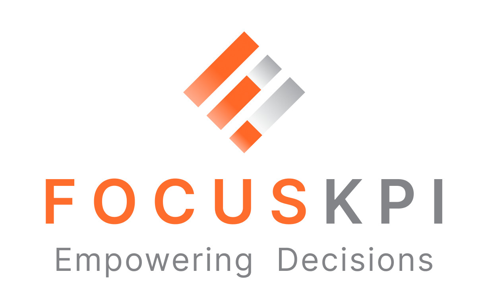
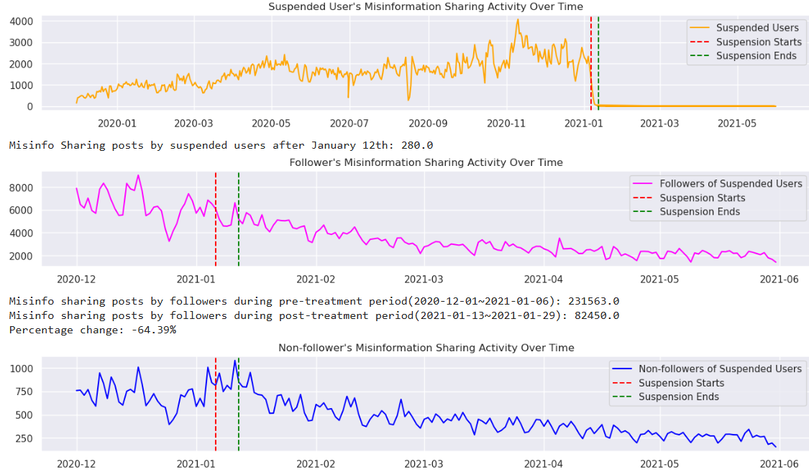
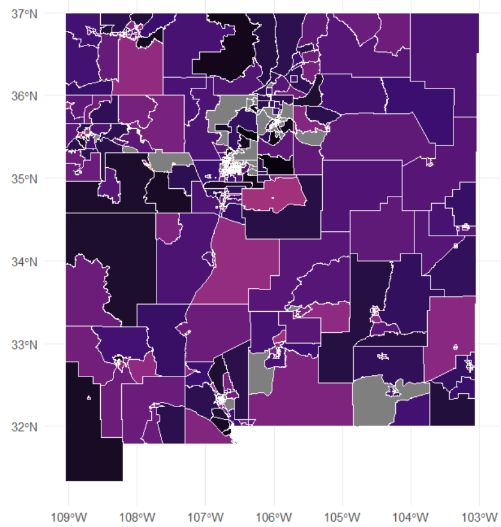
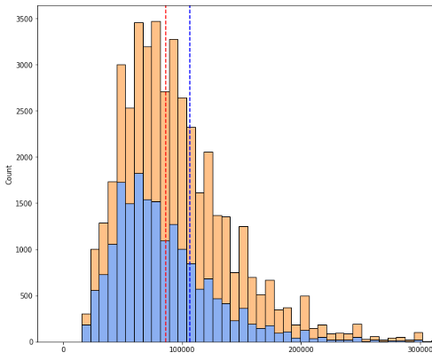

## Hi, I'm Sangmin (or Sandy)!  
I'm a data analyst passionate about uncovering insights and driving impact across product, strategy, and operations. I'm currently completing my [Master's in Computational Social Science](https://macss.berkeley.edu/) at UC Berkeley, where I focus on applying data analytics, machine learning, and data storytelling to solve real-world problems. 
Before grad school, I worked as a Business Analyst at the world's 3rd busiest international airport, where I used SQL, Tableau, and Advanced Excel to analyze large-scale aviation data, forecast demand, and build dashboards that supported new route development and real-time performance tracking. 
At Berkeley, I was trained to own the full analytics lifecycle, from data engineering and modeling to deployment and insight delivery. I've led end-to-end analytics projects across private and public sectors. At [FocusKPI](https://www.focuskpi.com/), I built an [AI-powered app review pipeline and dashboard](https://www.youtube.com/watch?v=NK6nVT0ubZw) that identified churn drivers from 10k+ reviews, helping product teams prioritize feature improvements and shape product roadmaps. For my capstone, I partnered with the [Berkeley Police Department](https://bpd-transparency-initiative-berkeleypd.hub.arcgis.com/) to build a [GIS-based patrol zone optimization tool](https://drive.google.com/file/d/1GJc5lvHSB6qTAfGMJtgMgJdN7yne0bsp/view), now adopted for strategic planning. In both projects, I've built scalable pipelines, designed custom metrics, and delivered insights via self-serve dashboards for non-technical stakeholders. 
At MaCSS, I've also contributed to research projects that advance data-driven policymaking in California, including topics on housing displacement, gender disparities in labor market, and misinformation on social media. 
Ultimately, I'm drawn to roles where I can apply technical rigor to meaningful challenges, whether improving user experiences in tech or advancing social impact in public policy. With experience working across both domains, I bring a unique ability to translate complex data into real-world impact across people, products, and policy.

## Work

I feel most fulfilled when developing impactful solutions to real-world problems or exploring innovative technologies.

<table>
<tr>
<td width="90" align="center" valign="top">
  
</td>
<td valign="top">
  <b>FocusKPI, Inc</b> 
  <i>Data Science Intern, Jan 2025 - Present</i> 
  <a href="https://www.youtube.com/watch?v=NK6nVT0ubZw">Watch Demo Video</a> | <a href="https://github.com/sandy-lee29/musicapp-review-analysis">Github Repo</a> 
  At FocusKPI, I partnered with a leading analytics consultancy to build an AI-powered app review analysis pipeline that processed and tagged over 100,000 reviews by sentiment, topic, and product issue. Leveraging techniques such as prompt engineering with GPT-4o and short-text semantic grouping, I engineered an end-to-end system that surfaced key churn drivers and powered an interactive Streamlit dashboard for product teams. I also developed automated reporting logic to rank user issues by estimated revenue risk, enabling product teams to prioritize features and shape data-driven roadmap decisions. The project was showcased at a final Demo Day, highlighting its value to stakeholders and demonstrating its potential for real-world impact.
</td>
</tr>
</table>

<table>
<tr>
<td width="90" align="center" valign="top">
  
</td>
<td valign="top">
  <b>Berkeley Police Department, Office of Strategic Planning & Accountability</b> 
  <i>Data Analyst, Jan 2025 - April 2025</i> 
  <a href="https://drive.google.com/file/d/1GJc5lvHSB6qTAfGMJtgMgJdN7yne0bsp/view">Full Project Report</a> | <a href="https://github.com/sandy-lee29/patrol-optimization">Github Repo</a> 
  At BPD, I built an innovative GIS-based patrol zone optimization tool that analyzed 60,000+ service calls to uncover workload imbalances and recommend data-driven boundary redesigns. Using Python, GeoPandas, and Shapely, I engineered geospatial algorithms that integrated response time, call priority, and disposition data into a normalized Police Patrol Workload Score, enabling more equitable resource allocation across patrol sectors. I built [interactive maps in Tableau](https://public.tableau.com/app/profile/sangmin.sandy.lee/viz/BerkeleyPoliceCallsDashboard/BerkeleyPolice) to visualize service call distribution and developed sector-level dashboards in Streamlit with custom KPIs to analyze workload and visualize high-priority hotspots. The tool produced year-over-year comparison maps and scenario testing outputs, which were adopted by the Office of Strategic Planning to guide annual patrol updates. This project not only improved workload equity by 15% but also established a replicable framework for operational decision-making through geospatial analytics.
</td>
</tr>
</table>

<table>
<tr>
<td width="90" align="center" valign="top">
  
</td>
<td valign="top">
  <b>Incheon International Airport Corporation</b> 
  <i>Business Analyst, Oct 2018 – Jul 2024</i> 
  <a href="https://www.airport.kr/co_en/index.do">Company Website</a> | <a href="https://www.airport.kr/co_en/4284/subview.do?enc=Zm5jdDF8QEB8JTJGYmJzJTJGY29fZW4lMkY0NjclMkYxMzY1MjYlMkZhcnRjbFZpZXcuZG8lM0Y%3D">New Routes Incubating Program</a> 
  At IIAC, I worked as a Business Analyst supporting airline marketing and international route development strategy for the world's 3rd busiest airport. I used SQL to pull and analyze large traffic datasets and delivered KPI reports to senior leadership, enabling data-informed decisions across aviation marketing, airline partnerships, and new route planning. I also designed and maintained 50+ Tableau and Excel dashboards to monitor performance metrics, market trends, and campaign effectiveness in real time. My analysis informed strategic decisions for the New Routes Incubating Program, which provided targeted marketing incentives to transition irregular flights into regular routes. By analyzing airline traffic patterns, competitor capacity, and market segmentation, I identified new revenue opportunities and supported strategic outreach, contributing to a 7% increase in APAC market share.
</td>
</tr>
</table>

## Data Projects

Here are some of my recent research projects and analyses.

<table>
<tr>
<td width="100" align="center" valign="top">
  
</td>
<td valign="top">
  <b>Deplatforming and the Decline of Misinformation: A Twitter Case Study</b> 
  <i>Tools Used: Python (pandas, statsmodels), Difference-in-Differences</i> 
  <a href="https://medium.com/@sangmin.lee.ir/evaluating-the-effectiveness-of-twitters-deplatforming-as-a-content-moderation-strategy-1066dea05a46">Medium Post</a> | <a href="https://github.com/sandy-lee29/Twitter-DiD-Analysis-Project">Github Repo</a> 
  In this project, I explored whether deplatforming after January 6th effectively reduced misinformation on Twitter. Using a Difference-in-Differences (DiD) approach, I analyzed a comprehensive dataset tracking fake and non-fake posts over time, focusing on user groups such as "QAnon" affiliates and suspended accounts. The analysis revealed a significant decline in misinformation sharing post-deplatforming, especially among the targeted user groups, with notable drops in retweets and post initiations. The study underscored the potential of deplatforming as a tool to curb misinformation while raising important questions about broader implications of content moderation.
</td>
</tr>
</table>

<table>
<tr>
<td width="100" align="center" valign="top">
  
</td>
<td valign="top">
  <b>Mapping Displacement Risk in the Bay Area: A Spatial Data Approach</b> 
  <i>Tools Used: R (tidycensus, sf, ggplot2), Spatial Analysis</i> 
  <a href="https://github.com/sandy-lee29/housing-displacement-risk-analysis/blob/main/Measuring%20Displacement%20Risk%20using%20U.S.%20Census%20and%20Eviction%20Lab%20Data.pdf">Project Report</a> | <a href="https://github.com/sandy-lee29/housing-displacement-risk-analysis">Github Repo</a> 
  In this project, I developed a Displacement Risk Index to assess housing vulnerability across Bay Area census tracts. By spatially linking ACS 5-Year Census data with Eviction Lab records, I quantified the risk of displacement and visualized high-risk zones through choropleth maps. The analysis focused on the New Mexico tract, a neighborhood in the Bay Area exhibiting pronounced displacement signals. Communities with high renter concentrations, Hispanic populations, and senior residents were identified as especially vulnerable. This project provided a data-driven perspective on housing precarity and aimed to inform equitable urban planning and targeted policy interventions.
</td>
</tr>
</table>

<table>
<tr>
<td width="100" align="center" valign="top">
  
</td>
<td valign="top">
  <b>Quantifying Gender Disparities in the U.S. Workforce: Insights from the NSCG Survey Data</b> 
  <i>Tools Used: SQL, Python (pandas, statsmodels), Multiple Regression</i> 
  <a href="https://app.hex.tech/beresford-berkeley/app/315e596f-34be-45ff-8e87-88718e92ae70/latest">Project Report</a> 
  In this project, I analyzed wage disparities by gender and family structure using the 2021 National Survey of College Graduates (NSCG). Leveraging multiple regression with interaction terms, I quantified the motherhood penalty and examined how family structure amplifies wage gaps. The results revealed persistent structural inequities, particularly affecting mothers and unmarried women with children. The findings provide actionable insights to support equity-focused workforce policies and guide interventions for vulnerable subgroups.
</td>
</tr>
</table>

## Analytical Skills

Through real-world projects and graduate coursework, I've developed hands-on technical and analytical skills across the full data lifecycle, from engineering scalable pipelines to modeling and visualizing outcomes.

**Languages & Tools**  
Python (pandas, numpy, scikit-learn, seaborn, matplotlib), R (dplyr, tidyr, ggplot2), SQL, Git, Docker

**Dashboards & Visualization**  
Built interactive dashboards using Tableau, Streamlit, and Power BI to surface trends, KPIs, and strategy insights across projects in transportation, product analytics, and civic operations.

**Machine Learning & Modeling**  
Applied regression, classification, and gradient boosting (XGBoost, CatBoost) for forecasting and prioritization tasks. Used dimensionality reduction and clustering for feature construction, anomaly detection, and segmentation.

**Natural Language Processing**  
Used spaCy, NLTK, and Sentence-BERT for topic modeling, sentiment analysis, and semantic clustering of app reviews and policy texts. Integrated GPT-4 APIs for scalable tagging and summarization.

**Causal & Statistical Inference**  
Experienced in EDA, A/B testing, and quasi-experimental methods such as  Difference-in-Differences and propensity score matching to evaluate real-world policy and product interventions.

**Data Engineering**  
Developed ETL pipelines to integrate multi-source datasets, such as transportation and geospatial data in CSV, JSON, and Shapefile formats, and automated external data collection using APIs and scraping tools (Requests, BeautifulSoup, Selenium).

**Cloud & Warehousing**  
Queried large datasets from BigQuery and Snowflake to support data-driven strategy and reporting.
